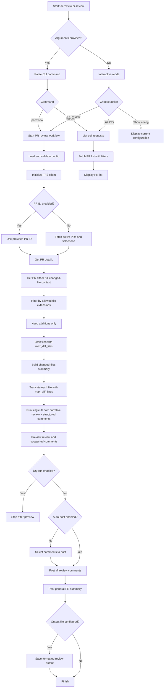

# AI Code Review

Automated code review tool with Pull Request integration for Azure DevOps/TFS and support for multiple LLM providers.

The main entry point is in `src/ai_review.py`. The project also includes dedicated modules for configuration, output formatting, Git diff capture, TFS/Azure DevOps integration, and communication with the LLM provider.

## Features

- AI Pull Request review (`pr-review`)
- Structured PR comments (inline + general summary)
- `dry-run` mode to validate without posting
- PR listing with filters (`list-prs`)
- Configuration exclusively via `config.yaml`
- Providers LLM: OpenAI, Azure OpenAI, Gemini, Claude, Ollama, GitHub Copilot, AWS Bedrock

## Installation

Install from PyPI:

```bash
pip install code-review-ai-cli
```

Or install with optional LLM SDK extras:

```bash
pip install "code-review-ai-cli[bedrock]"    # AWS Bedrock
pip install "code-review-ai-cli[openai]"     # OpenAI SDK
pip install "code-review-ai-cli[gemini]"     # Google Gemini SDK
pip install "code-review-ai-cli[claude]"     # Anthropic Claude SDK
pip install "code-review-ai-cli[all]"        # All optional SDKs
```

All providers also work without their optional SDK — the tool communicates via HTTP directly.

If you plan to run the test suite locally, also install development dependencies:

```bash
pip install "code-review-ai-cli[dev]"
```

## Configuration

After installing the package, generate ready-to-edit configuration files in your working directory:

```bash
ai-review init
```

This copies two bundled templates:

- **`config.yaml`** — all available options with inline documentation
- **`review_prompt.md`** — default review style rules, injected into every LLM prompt

The tool looks for `config.yaml` in the **current working directory** at runtime. You can also pass a different path with `--config`:

```bash
ai-review pr-review --config ~/configs/ai-review.yaml
```

### Minimal Example

```yaml
llm:
  provider: openai
  model: gpt-4o

openai:
  api_key: sk-xxxx

tfs:
  base_url: https://dev.azure.com/your-organization
  project: ProjectName
  pat: xxxxxxxxx
  verify_ssl: true
  # ca_bundle: C:/certs/corporate-root-ca.pem

review:
  verbosity: detailed
  scope: diff_only
  custom_prompt_file: review_prompt.md
  # file limit sent to the LLM
  max_diff_files: 50
  # per-file limit
  max_diff_lines: 2000
  # extension allowlist (empty list = all files)
  file_extensions_filter: [".cs", ".ts", ".py"]

pr:
  auto_post_comments: false
  dry_run: false
  comment_mode: structured

output:
  format: terminal
  file: ""
  color: true
```

### Review Scope

`review.scope` controls how much code is sent to the LLM for each changed file.

| Scope | Description |
|---|---|
| `diff_only` | Default. Unified diff (changed lines only) + full file content as read-only context. |
| `full_code` | All lines of the new file version, every line prefixed with `+`. No baseline. |

#### `diff_only` — diff with context (default)

```yaml
review:
  scope: diff_only
  scope: full_code
```

### Filter by File Extension

`file_extensions_filter` works as an **allowlist**: only files with listed extensions are sent to the LLM for review. Remaining files are excluded from the diff before any processing.

```yaml
review:
  # Review only C#, TypeScript, and Python code
  file_extensions_filter: [".cs", ".ts", ".py"]
```

To review **all** PR files, leave the list empty:

```yaml
review:
  file_extensions_filter: []
```

> **Note:** If no eligible files remain after filtering, the review ends with a warning without calling the LLM.

### Markdown-Customizable Prompt

`ai-review init` creates a `review_prompt.md` alongside `config.yaml`. This file is loaded automatically and injected into LLM instructions on every run.

Edit it to tailor the review to your team:

- Define comment tone and format
- Add mandatory validation rules
- Include business/architecture context
- Add examples of good/bad comments

**Rules can be scoped** to specific file types using language tags. During a review, the AI detects the files changed in the diff, identifies their extensions, and only loads:

- Rules marked with `<!-- lang: all -->` for all files.
- Rules matching the extensions of the files being reviewed. Example `<!-- lang: cs,ts -->` applied when .cs or .ts files are present.

The path for the **markdown-customizable prompt** is configurable in `config.yaml` (default: `review_prompt.md` in the current directory):

```yaml
review:
  custom_prompt_file: review_prompt.md
```

### Bedrock Example

**Option 1 — Bedrock long-term API key** (AWS Console → Amazon Bedrock → API Keys):
```yaml
llm:
  provider: bedrock
  model: arn:aws:bedrock:eu-north-1:123456789:application-inference-profile/xxxxxxxx

bedrock:
  region: eu-north-1
  access_key_id: ABSK...   # long-term API key — no secret_access_key
```

**Option 2 — IAM explicit credentials** (access key ID + secret):
```yaml
llm:
  provider: bedrock
  model: anthropic.claude-3-5-sonnet-20240620-v1:0

bedrock:
  region: us-east-1
  access_key_id: AKIA...
  secret_access_key: wJalr...
  # session_token: ...   # optional, for temporary STS credentials
```

**Option 3 — AWS SSO / named profile**:
```yaml
bedrock:
  region: us-east-1
  profile: my-sso-profile
```

## CLI Usage

### Help

```bash
ai-review pr-review --help
```

### Bootstrap configuration

Generate `config.yaml` and `review_prompt.md` templates in the current directory:

```bash
ai-review init
```

### Interactive Mode

```bash
 ai-review pr-review
```

### Pull Request Review

List PRs and select interactively:

```bash
 ai-review pr-review pr-review
```

Review a specific PR:

```bash
 ai-review pr-review pr-review 42
```

Dry-run:

```bash
 ai-review pr-review pr-review 42 --dry-run
```

Full review of changed files (in addition to diff-focused review):

```bash
 ai-review pr-review pr-review 42 --review-scope full_code
```

Automatic posting (without confirmation):

```bash
 ai-review pr-review pr-review 42 --auto-post
```

Filter PRs in interactive selection:

```bash
 ai-review pr-review pr-review --author "John Smith" --target-branch main
```

Choose provider/model via CLI:

```bash
 ai-review pr-review pr-review 42 --provider bedrock --model anthropic.claude-3-5-sonnet-20240620-v1:0
```

### List Pull Requests

```bash
 ai-review pr-review list-prs
 ai-review pr-review list-prs --status completed
 ai-review pr-review list-prs --repo-name backend --author "John"
```

## Execution Flow

The diagram below summarizes how the review application moves from CLI entry to PR analysis and comment posting.



## Supported Commands and Options

### `pr-review`

```bash
 ai-review pr-review pr-review [pr_id]
```

Options:

- `--repo-name`, `-r`
- `--dry-run`
- `--auto-post`
- `--author`
- `--target-branch`
- `--quick` / `--detailed` / `--security`
- `--review-scope {diff_only,full_code}` (default: `diff_only`)
- `--max-diff-files N` — overrides `review.max_diff_files` from config.yaml
- `--context`, `-c`
- `--format {terminal,markdown,json}`
- `--output`, `-o`
- `--no-color`
- `--debug-dump`
- `--model`, `-m`
- `--provider`, `-p`
- `--config`

### `list-prs`

```bash
 ai-review pr-review list-prs
```

Options:

- `--repo-name`, `-r`
- `--status {active,completed,abandoned,all}`
- `--author`

## Available VS Code Tasks

- `AI Review: Pull Request (Interactive)`
- `AI Review: PR (Dry-Run)`
- `AI Review: List Active PRs`
- `AI Review: Interactive Mode`

## Troubleshooting

### TLS/SSL Error in On-Prem TFS

Prefer using a CA bundle:

```yaml
tfs:
  verify_ssl: true
  ca_bundle: C:/certs/corporate-root-ca.pem
```

Avoid `verify_ssl: false` except for temporary troubleshooting.

### Debug Dump

```yaml
debug:
  dump: true
  dump_file: logs/llm_prompt_debug.log
```