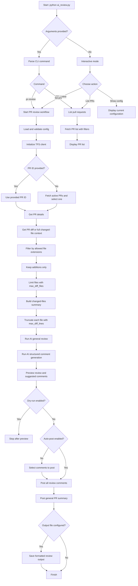

# AI Code Review

Automated code review tool with Pull Request integration for Azure DevOps/TFS and support for multiple LLM providers.

The main entry point is in `src/ai_review.py`. The project also includes dedicated modules for configuration, output formatting, Git diff capture, TFS/Azure DevOps integration, and communication with the LLM provider.

## Features

- AI Pull Request review (`pr-review`)
- Structured PR comments (inline + general summary)
- `dry-run` mode to validate without posting
- PR listing with filters (`list-prs`)
- Configuration exclusively via `config.yaml`
- Providers LLM: OpenAI, Azure OpenAI, Gemini, Claude, Ollama, GitHub Copilot, AWS Bedrock

## Installation

Install from PyPI:

```bash
pip install ai-code-review-cli
```

Or install with optional LLM SDK extras:

```bash
pip install "ai-code-review-cli[bedrock]"    # AWS Bedrock
pip install "ai-code-review-cli[openai]"     # OpenAI SDK
pip install "ai-code-review-cli[gemini]"     # Google Gemini SDK
pip install "ai-code-review-cli[claude]"     # Anthropic Claude SDK
pip install "ai-code-review-cli[all]"        # All optional SDKs
```

All providers also work without their optional SDK — the tool communicates via HTTP directly.

If you plan to run the test suite locally, also install development dependencies:

```bash
pip install "ai-code-review-cli[dev]"
```

## Configuration

After installing the package, generate a ready-to-edit `config.yaml` in your working directory:

```bash
ai-review init
```

This copies the bundled template with all available options and inline documentation:

```
✅ config.yaml created at: /home/user/my-project/config.yaml
   Edit it to add your credentials and preferences.
```

If a `config.yaml` already exists you will be prompted before it is overwritten:

```
config.yaml already exists in the current directory.
Overwrite? [y/N]
```

The tool looks for `config.yaml` in the **current working directory** at runtime. You can also pass a different path with `--config`:

```bash
ai-review pr-review --config ~/configs/ai-review.yaml
```

### Minimal Example

```yaml
llm:
  provider: openai
  model: gpt-4o

openai:
  api_key: sk-xxxx

tfs:
  base_url: https://dev.azure.com/your-organization
  project: ProjectName
  pat: xxxxxxxxx
  verify_ssl: true
  # ca_bundle: C:/certs/corporate-root-ca.pem

review:
  language: pt
  verbosity: detailed
  scope: diff_only
  custom_prompt_file: review_prompt.md
  # file limit sent to the LLM
  max_diff_files: 50
  # per-file limit
  max_diff_lines: 2000
  # extension allowlist (empty list = all files)
  file_extensions_filter: [".cs", ".ts", ".py"]

pr:
  auto_post_comments: false
  dry_run: false
  comment_mode: structured

output:
  format: terminal
  file: ""
  color: true
```

### Filter by File Extension

`file_extensions_filter` works as an **allowlist**: only files with listed extensions are sent to the LLM for review. Remaining files are excluded from the diff before any processing.

```yaml
review:
  # Review only C#, TypeScript, and Python code
  file_extensions_filter: [".cs", ".ts", ".py"]
```

To review **all** PR files, leave the list empty:

```yaml
review:
  file_extensions_filter: []
```

> **Note:** If no eligible files remain after filtering, the review ends with a warning without calling the LLM.

### Markdown-Customizable Prompt

You can adjust review rules, context, and examples in `review_prompt.md`.
This file is loaded automatically and injected into LLM instructions on each run.

Example in `config.yaml`:

```yaml
review:
  custom_prompt_file: review_prompt.md
```

Suggested usage for this file:

- Define comment tone and format
- Add mandatory validation rules
- Include business/architecture context
- Add examples of good/bad comments

### Bedrock Example

```yaml
llm:
  provider: bedrock
  model: anthropic.claude-3-5-sonnet-20240620-v1:0

bedrock:
  region: us-east-1
  # profile: default
  # access_key_id: AKIA...
  # secret_access_key: ...
  # session_token: ...

tfs:
  base_url: https://dev.azure.com/your-organization
  project: ProjectName
  pat: xxxxxxxxx
```
Bedrock notes:

- You can use `profile` or explicit credentials in YAML.
- If explicit credentials are not defined, the AWS SDK uses the default credentials chain.

## Review Flow

The main `pr-review` workflow is:

1. load and validate configuration
2. fetch Pull Request metadata from Azure DevOps/TFS
3. fetch the PR diff
4. filter and truncate the diff according to configuration
5. request textual analysis and structured comments from the LLM provider
6. display a preview in the terminal
7. post inline or general PR comments when applicable

## Tests

The project's functional coverage is reflected in the `tests/` folder, including:

- `tests/test_ai_review.py` for the CLI and main workflow
- `tests/test_config.py` for configuration and validation
- `tests/test_formatter.py` for terminal/markdown/json rendering
- `tests/test_git_utils.py` for diffs and Git utilities
- `tests/test_llm_client.py` for prompts, parsing, and LLM providers
- `tests/test_tfs_client.py` for TFS/Azure DevOps integration

Run the suite:

```bash
python -m pytest --cov=src --cov-report=term
```

## CLI Usage

### Help
```bash
python src/ai_review.py --help
```

### Bootstrap configuration

Generate a `config.yaml` template in the current directory:

```bash
ai-review init
```

### Interactive Mode

```bash
python ai_review.py
```

### Pull Request Review

List PRs and select interactively:

```bash
python ai_review.py pr-review
```

Review a specific PR:

```bash
python ai_review.py pr-review 42
```

Dry-run:

```bash
python ai_review.py pr-review 42 --dry-run
```

Full review of changed files (in addition to diff-focused review):

```bash
python ai_review.py pr-review 42 --review-scope full_code
```

Automatic posting (without confirmation):

```bash
python ai_review.py pr-review 42 --auto-post
```

Filter PRs in interactive selection:

```bash
python ai_review.py pr-review --author "John Smith" --target-branch main
```

Choose provider/model via CLI:

```bash
python ai_review.py pr-review 42 --provider bedrock --model anthropic.claude-3-5-sonnet-20240620-v1:0
```

### List Pull Requests

```bash
python ai_review.py list-prs
python ai_review.py list-prs --status completed
python ai_review.py list-prs --repo-name backend --author "John"
```

## Execution Flow

The diagram below summarizes how the review application moves from CLI entry to PR analysis and comment posting.



## Supported Commands and Options

### `pr-review`

```bash
python ai_review.py pr-review [pr_id]
```

Options:

- `--repo-name`, `-r`
- `--dry-run`
- `--auto-post`
- `--author`
- `--target-branch`
- `--quick` / `--detailed` / `--security`
- `--review-scope {diff_only,full_code}` (default: `diff_only`)
- `--max-diff-files N` — overrides `review.max_diff_files` from config.yaml
- `--context`, `-c`
- `--format {terminal,markdown,json}`
- `--output`, `-o`
- `--no-color`
- `--model`, `-m`
- `--provider`, `-p`
- `--config`

### `list-prs`

```bash
python ai_review.py list-prs
```

Options:

- `--repo-name`, `-r`
- `--status {active,completed,abandoned,all}`
- `--author`

## Available VS Code Tasks

- `🌟 AI Review: Pull Request (Interactive)`
- `🌟 AI Review: PR (Dry-Run)`
- `📋 AI Review: List Active PRs`
- `🤖 AI Review: Interactive Mode`

## Troubleshooting

### TLS/SSL Error in On-Prem TFS

Prefer using a CA bundle:

```yaml
tfs:
  verify_ssl: true
  ca_bundle: C:/certs/corporate-root-ca.pem
```

Avoid `verify_ssl: false` except for temporary troubleshooting.

### Bedrock Authentication Error

- Confirm `bedrock.region`.
- Confirm `llm.model` with a valid Bedrock model ID in the chosen region.
- Validate AWS credentials (`profile` or explicit keys).

## Architecture

```text
ai_code_review_script/
├── src/
│   ├── config.py         # YAML-only configuration
│   ├── ai_review.py      # Main PR CLI and workflow
│   ├── llm_client.py     # LLM provider integration (includes Bedrock)
│   ├── tfs_client.py     # Azure DevOps/TFS (PRs and comments)
│   ├── formatter.py      # Output formatting
│   └── git_utils.py      # Utilities for diff parsing/truncation
├── config.yaml           # Single configuration file
├── requirements.txt      # Python dependencies
└── .vscode/tasks.json    # PR review tasks
```
