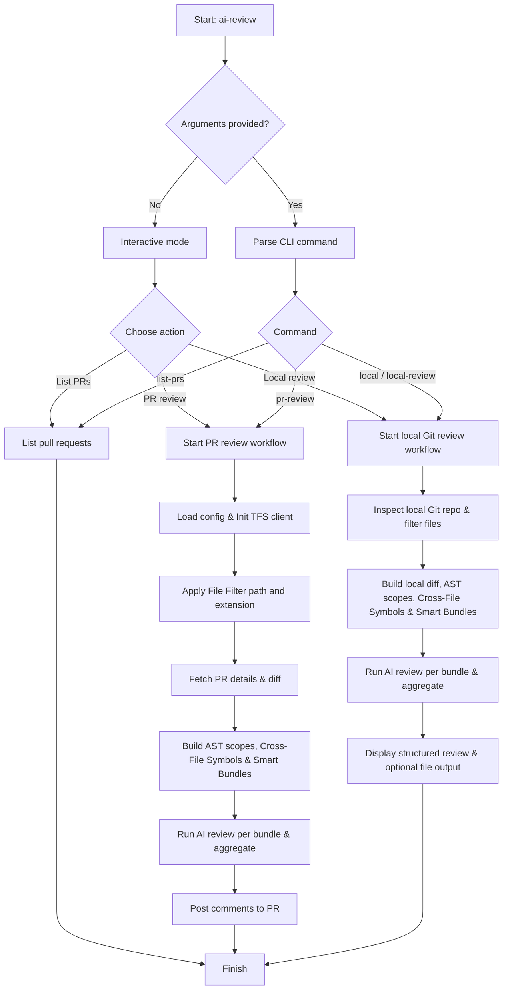

# Execution Flow

The diagram below summarizes how the review application moves from CLI entry to PR or local Git analysis and comment presentation/posting.

```mermaid
flowchart TD
  Start[Start: ai-review] --> CheckArgs{Arguments provided?}
  CheckArgs -->|No| Interactive[Interactive mode]
  CheckArgs -->|Yes| Parse[Parse CLI command]

  Interactive --> Action{Choose action}
  Action -->|PR review| PRReview[Start PR review workflow]
  Action -->|Local review| LocalReview[Start local Git review workflow]
  Action -->|List PRs| ListPRs[List pull requests]
  
  Parse --> Command{Command}
  Command -->|pr-review| PRReview
  Command -->|local / local-review| LocalReview
  Command -->|list-prs| ListPRs

  PRReview --> Filter[Load config & Init TFS client]
  Filter --> Config[Apply File Filter path and extension]
  Config --> FetchPR[Fetch PR details & diff]
  FetchPR --> BuildContext["Build AST scopes, Cross-File Symbols & Smart Bundles"]
  BuildContext --> AI[Run AI review per bundle & aggregate]
  AI --> Post[Post comments to PR]

  LocalReview --> LocalGit[Inspect local Git repo & filter files]
  LocalGit --> LocalContext["Build local diff, AST scopes, Cross-File Symbols & Smart Bundles"]
  LocalContext --> LocalAI[Run AI review per bundle & aggregate]
  LocalAI --> LocalOut[Display structured review & optional file output]
  
  ListPRs --> End[Finish]
  Post --> End
  LocalOut --> End
```
