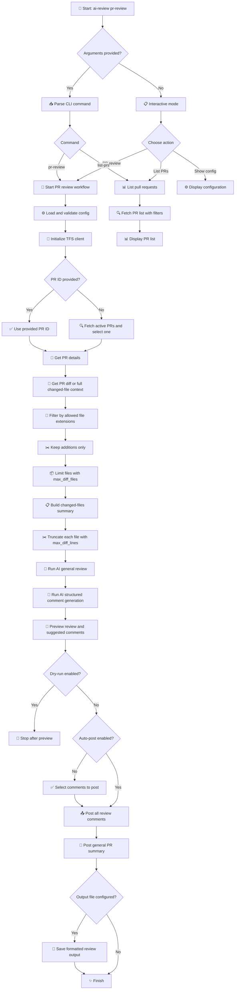
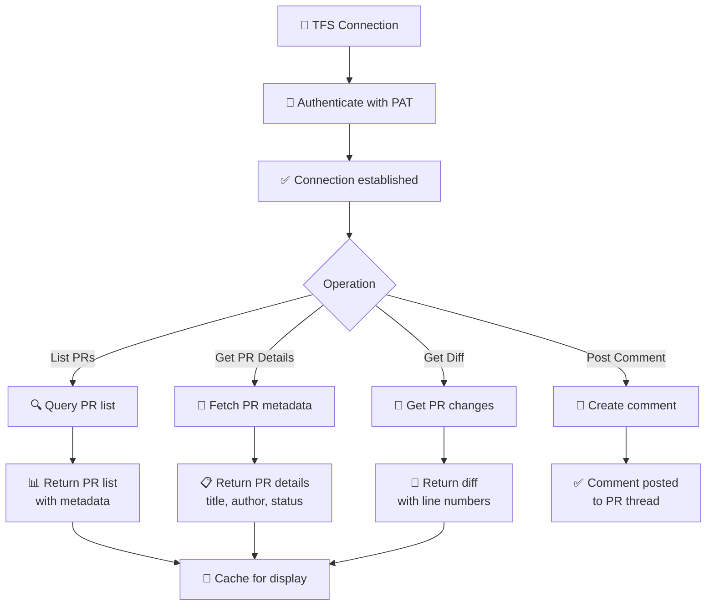

# Main Application Flow

```mermaid
flowchart TD
  A["🚀 Start: ai-review pr-review"] --> B{Arguments provided?}
  B -->|No| C["📋 Interactive mode"]
  B -->|Yes| D["📥 Parse CLI command"]

  C --> E{Choose action}
  E -->|PR review| F["🔄 Start PR review workflow"]
  E -->|List PRs| G["📊 List pull requests"]
  E -->|Show config| H["⚙️ Display configuration"]

  D --> I{Command}
  I -->|pr-review| F
  I -->|list-prs| G

  F --> J["⚙️ Load and validate config"]
  J --> K["🔗 Initialize TFS client"]
  K --> L{PR ID provided?}
  L -->|No| M["🔍 Fetch active PRs and select one"]
  L -->|Yes| N["✅ Use provided PR ID"]
  M --> O["📄 Get PR details"]
  N --> O
  O --> P["🔀 Get PR diff or full changed-file context"]
  P --> Q["🎯 Filter by allowed file extensions"]
  Q --> R["✂️ Keep additions only"]
  R --> S["📦 Limit files with max_diff_files"]
  S --> T["📋 Build changed-files summary"]
  T --> U["✂️ Truncate each file with max_diff_lines"]
  U --> V["🤖 Run AI general review"]
  V --> W["💬 Run AI structured comment generation"]
  W --> X["👀 Preview review and suggested comments"]
  X --> Y{Dry-run enabled?}
  Y -->|Yes| Z["🛑 Stop after preview"]
  Y -->|No| AA{Auto-post enabled?}
  AA -->|Yes| AB["📤 Post all review comments"]
  AA -->|No| AC["✅ Select comments to post"]
  AC --> AB
  AB --> AD["📝 Post general PR summary"]
  AD --> AE{Output file configured?}
  AE -->|Yes| AF["💾 Save formatted review output"]
  AE -->|No| AG["✨ Finish"]
  AF --> AG

  G --> AH["🔍 Fetch PR list with filters"]
  AH --> AI["📊 Display PR list"]
```

# TFS/Azure DevOps Integration

```mermaid
flowchart TD
  A["🔗 TFS Connection"] --> B["🔑 Authenticate with PAT"]
  B --> C["✅ Connection established"]
  C --> D{Operation}
  
  D -->|List PRs| E["🔍 Query PR list"]
  D -->|Get PR Details| F["📄 Fetch PR metadata"]
  D -->|Get Diff| G["🔀 Get PR changes"]
  D -->|Post Comment| H["📝 Create comment"]
  
  E --> I["📊 Return PR list<br/>with metadata"]
  F --> J["📋 Return PR details<br/>title, author, status"]
  G --> K["🔀 Return diff<br/>with line numbers"]
  H --> L["✅ Comment posted<br/>to PR thread"]
  
  I --> M["💾 Cache for display"]
  J --> M
  K --> M
```