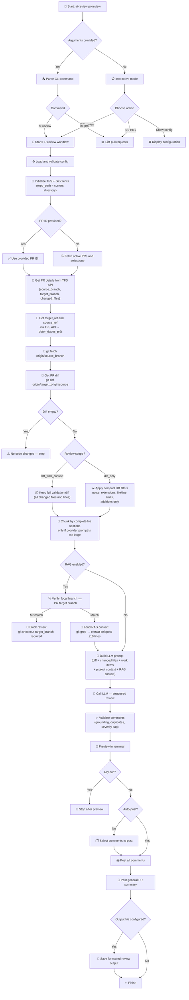

# Execution Flow Diagrams

## Main PR Review Flow

```mermaid
flowchart TD
  A["🚀 Start: ai-review pr-review"] --> B{Arguments provided?}
  B -->|No| C["📋 Interactive mode"]
  B -->|Yes| D["📥 Parse CLI command"]

  C --> E{Choose action}
  E -->|PR review| F["🔄 Start PR review workflow"]
  E -->|List PRs| G["📊 List pull requests"]
  E -->|Show config| H["⚙️ Display configuration"]

  D --> I{Command}
  I -->|pr-review| F
  I -->|list-prs| G

  F --> J["⚙️ Load and validate config"]
  J --> K["🔗 Initialize TFS + Git clients\n(repo_path = current directory)"]
  K --> L{PR ID provided?}
  L -->|No| M["🔍 Fetch active PRs and select one"]
  L -->|Yes| N["✅ Use provided PR ID"]
  M --> O["📄 Get PR details from TFS API\n(source_branch, target_branch, changed_files)"]
  N --> O
  O --> P["🔑 Get target_ref and source_ref\nvia TFS API → obter_dados_pr()"]
  P --> Q["📡 git fetch origin/source_branch"]
  Q --> R["🔀 Get PR diff\ngit diff origin/target...origin/source"]
  R --> S{Diff empty?}
  S -->|Yes| Z1["⚠️ No code changes — stop"]
  S -->|No| W{Review scope?}
  W -->|diff_only| X["✂️ Apply compact diff filters\nnoise, extensions, file/line limits,\nadditions only"]
  W -->|diff_with_context| Y["📦 Keep full validation diff\n(all changed files and lines)"]
  X --> AA
  Y --> AA["🧩 Chunk by complete file sections\nonly if provider prompt is too large"]
  AA --> BB{RAG enabled?}
  BB -->|No| CC["🤖 Build LLM prompt\n(diff + changed files + work items\n+ project context + RAG context)"]
  BB -->|Yes| DD["🔍 Verify: local branch == PR target branch"]
  DD -->|Mismatch| Z2["🚫 Block review\ngit checkout target_branch required"]
  DD -->|Match| EE["🧠 Load RAG context\ngit grep → extract snippets ±10 lines"]
  EE --> CC
  CC --> FF["💬 Call LLM — structured review"]
  FF --> GG["✅ Validate comments\n(grounding, duplicates, severity cap)"]
  GG --> HH["👀 Preview in terminal"]
  HH --> II{Dry-run?}
  II -->|Yes| Z3["🛑 Stop after preview"]
  II -->|No| JJ{Auto-post?}
  JJ -->|Yes| KK["📤 Post all comments"]
  JJ -->|No| LL["🗂️ Select comments to post"]
  LL --> KK
  KK --> MM["📝 Post general PR summary"]
  MM --> NN{Output file configured?}
  NN -->|Yes| OO["💾 Save formatted review output"]
  NN -->|No| PP["✨ Finish"]
  OO --> PP
```
